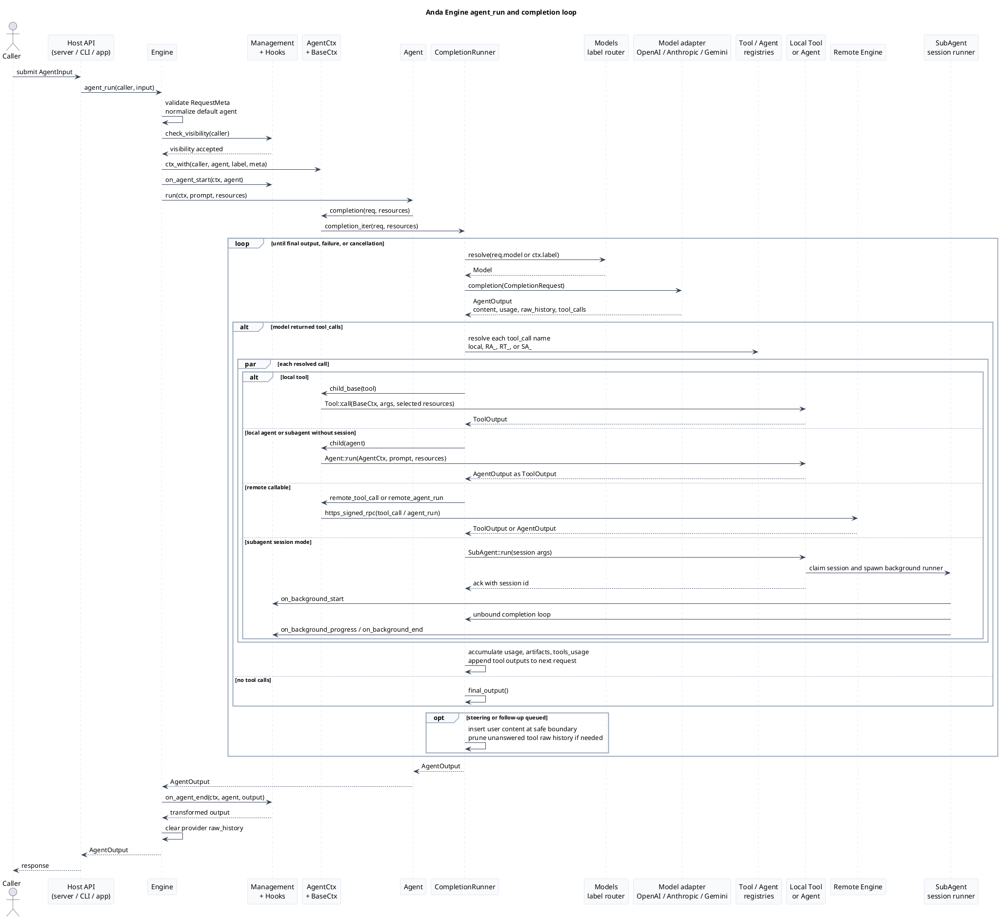

# Anda Engine Architecture

This document describes the current `anda_engine` runtime architecture from the source code. It replaces the older deployment-first narrative that treated ICP, TEE, and IC-TEE as mandatory runtime blocks.

In the current engine, those integrations are optional backing capabilities. The practical center of the system is the `Engine` runtime: it validates callers, creates scoped contexts, dispatches agents and tools, routes model calls, handles tool-call loops, and exposes selected local or remote functions.

Preview note: use [markdown-viewer/markdown-viewer-extension](https://github.com/markdown-viewer/markdown-viewer-extension) to preview this document with the embedded HTML architecture diagram and PlantUML sequence diagram rendered.

Source map:

- [`engine.rs`](../anda_engine/src/engine.rs): top-level `Engine`, `EngineBuilder`, exported APIs, management checks, hooks, challenge signing.
- [`context/agent.rs`](../anda_engine/src/context/agent.rs): `AgentCtx`, local/remote/subagent routing, `CompletionRunner`, `CompletionStream`.
- [`context/base.rs`](../anda_engine/src/context/base.rs): `BaseCtx`, scoped state, cache, store, keys, HTTP, signed RPC, cancellation.
- [`context/tool.rs`](../anda_engine/src/context/tool.rs): built-in discovery agents: `tools_groups`, `tools_search`, and `tools_select`.
- [`model.rs`](../anda_engine/src/model.rs): `Models` label router, provider adapters, retry and streaming helpers.
- [`subagent.rs`](../anda_engine/src/subagent.rs): reusable subagents, background sessions, compaction and handoff.
- [`memory.rs`](../anda_engine/src/memory.rs): conversation/resource storage and KIP/Cognitive Nexus tools.
- [`extension`](../anda_engine/src/extension.rs): built-in tool libraries such as filesystem, shell, fetch, skills, notes, todos, and memory.

## Runtime View

Anda Engine Runtime Architecture

Current source-level view: agents, tools, contexts, models, memory, and optional external capabilities.

Entrypoints

<strong>Host apps</strong> CLI, HTTP server, bot runtime, or embedded Rust application call the engine API.

<strong>Public API</strong> agent_runtool_callinformationchallenge

<strong>Remote peers</strong> Other engines can discover exported functions and call them through signed RPC.

Engine Boundary

<strong>Engine</strong><small>Owns runtime state, default agent, export lists, hooks, management policy.</small>

<strong>EngineBuilder</strong><small>Registers tools, agents, models, store, remote engines, subagents, and hooks.</small>

<strong>EngineCard</strong><small>Publishes exported agent/tool definitions for remote discovery.</small>

Access Control and Observation

<strong>Management</strong><small>Private, protected, or public visibility; controller and manager principals.</small>

<strong>Hooks</strong><small>on_agent_start/end and on_tool_start/end can reject, observe, or transform outputs.</small>

<strong>Cancellation</strong><small>Root and child cancellation tokens propagate through contexts and runners.</small>

Callable Registries

<strong>AgentSet</strong><small>Local agents, including built-in `tools_groups`, `tools_search`, `tools_select`, and `subagents_manager`.</small>

<strong>ToolSet / ToolProviderSet</strong><small>Static tools and runtime-discovered providers with function definitions, resource tags, and capability groups.</small>

<strong>RemoteEngines</strong><small>Remote function metadata routed with `RA_` and `RT_` prefixes.</small>

AgentCtx and CompletionRunner

<strong>AgentCtx</strong><small>Combines BaseCtx with models, tools, agents, subagents, and routing helpers.</small>

<strong>CompletionRunner</strong><small>Iterates model turns, executes tool calls, accumulates usage/artifacts, and returns final output.</small>

<strong>SubAgent sessions</strong><small>`SA_` workers support blocking calls or background sessions with progress/final hooks.</small>

BaseCtx Capability Surface

<strong>Scoped state</strong><small>Caller, request meta, elapsed time, typed state extensions, and depth-limited children.</small>

<strong>Store and cache</strong><small>Context-path namespaces isolate agent and tool data in object store and cache.</small>

<strong>External calls</strong><small>HTTP, signed RPC, key derivation/signing, and canister calls through a configured Web3SDK.</small>

Model Routing and Provider Adapters

<strong>Models</strong><small>Label map plus primary model. Labels such as `pro`, `flash`, or `lite` choose provider entries.</small>

<strong>Adapters</strong><small>OpenAI-compatible, Anthropic, Gemini, and custom `CompletionFeaturesDyn` providers.</small>

<strong>Reliability</strong><small>Request defaults, SSE/NDJSON parsing, one short retry, and retryable `ModelError` signals.</small>

Optional Extensions and Persistence

<strong>Built-in tools</strong><small>fetch, filesystem, shell, note, skill, todo, and memory tools register like any other tool.</small>

<strong>Memory</strong><small>Conversation/resource records in AndaDB; KIP commands backed by Cognitive Nexus.</small>

<strong>ObjectStore</strong><small>In-memory by default; local, cloud, or IC-COSE-compatible backends can be supplied.</small>

External Capabilities

<strong>Model providers</strong> Completion APIs are reached only through registered model adapters.

<strong>Web3SDK</strong> Can be a TEE client, a Web3 client, or a not-implemented placeholder.

<strong>HTTP resources</strong> Fetch and remote-engine calls use the context HTTP/signed-RPC traits.

<strong>Databases</strong> AndaDB and Cognitive Nexus are used when memory tools are registered.

Key point: the engine does not require a blockchain, TEE, or specific storage backend to schedule agents. Those are replaceable integrations behind `Web3SDK`, `Store`, model providers, or memory extensions.

## Request Sequence

## Component Notes

- `Engine` is the public runtime boundary. It enforces exported agent/tool lists for non-manager callers and always exports the default agent.
- `EngineBuilder` starts with in-memory storage, no implemented Web3 client, no external model, and built-in discovery/subagent control agents.
- `AgentCtx` is the main scheduling surface. It exposes local tools, dynamic tool providers, local agents, subagents, registered remote engines, and dynamic remote engines from cache.
- `CompletionRunner` is iterative. A model turn can return tool calls; the runner executes them and feeds tool outputs into the next model turn. Long-running runners can compact oversized history into a continuation handoff and resume from that summary.
- `tools_groups`, `tools_search`, and `tools_select` are agents, not side channels. `tools_groups` returns a compact directory of visible capability bundles; `tools_select` can expand one group into schemas, and discovered schemas stay in tool-output context while repeated payloads are compacted from conversation context.
- `BaseCtx` creates namespace-scoped child contexts. Agent paths use `a_<agent>`, tool paths use `t_<tool>`, and all store/cache operations are resolved under that path.
- `Models` routes by label first and then falls back to the primary/default model. Provider-specific names stay inside adapter configuration.
- `SubAgentManager` turns persisted or temporary `SubAgent` definitions into callable `SA_<name>` agents. Long-running subagent sessions use hooks to push progress and final output.
- Memory is an extension layer. Conversation/resource storage uses AndaDB collections, and persistent knowledge operations are exposed as KIP tools backed by Cognitive Nexus.
- Web3, TEE, ICP, and IC-COSE integrations are implementation choices behind `Web3SDK`, `HttpFeatures`, `KeysFeatures`, `CanisterCaller`, or `ObjectStore`. They are not mandatory architecture layers for the engine itself.
