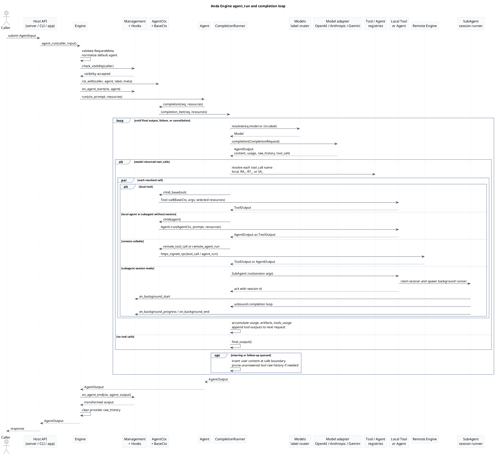

# Anda Engine 架构

本文基于当前 `anda_engine` 源码描述运行时架构，替换旧文档中把 ICP、TEE、IC-TEE 作为必需主路径的部署叙述。

当前引擎的实际核心是 `Engine` 运行时：校验调用者、创建隔离上下文、调度 agents 和 tools、路由模型请求、处理模型返回的 tool calls，并把需要暴露的本地或远程函数发布出去。Web3、TEE、ICP、IC-COSE 这类能力只是可替换的后端集成，不是理解或运行 engine 的前置条件。

预览提示：建议使用 [markdown-viewer/markdown-viewer-extension](https://github.com/markdown-viewer/markdown-viewer-extension) 预览本文档，以正确渲染内嵌 HTML 架构图和 PlantUML 时序图。

源码索引：

- [`engine.rs`](../anda_engine/src/engine.rs)：顶层 `Engine`、`EngineBuilder`、导出 API、管理策略、hooks、challenge 签名。
- [`context/agent.rs`](../anda_engine/src/context/agent.rs)：`AgentCtx`、本地/远程/subagent 路由、`CompletionRunner`、`CompletionStream`。
- [`context/base.rs`](../anda_engine/src/context/base.rs)：`BaseCtx`、隔离 state、cache、store、keys、HTTP、signed RPC、cancellation。
- [`context/tool.rs`](../anda_engine/src/context/tool.rs)：内置发现 agents：`tools_groups`、`tools_search` 和 `tools_select`。
- [`model.rs`](../anda_engine/src/model.rs)：`Models` 标签路由、provider adapters、重试和 streaming 解析。
- [`subagent.rs`](../anda_engine/src/subagent.rs)：可复用 subagents、后台 sessions、compaction 和 handoff。
- [`memory.rs`](../anda_engine/src/memory.rs)：conversation/resource 存储和 KIP/Cognitive Nexus tools。
- [`extension`](../anda_engine/src/extension.rs)：内置工具库，例如 filesystem、shell、fetch、skills、notes、todos、memory。

## 运行时视图

Anda Engine Runtime Architecture

当前源码视角：agents、tools、contexts、models、memory，以及可选外部能力。

入口

<strong>宿主应用</strong> CLI、HTTP server、bot runtime，或嵌入式 Rust 应用调用 engine API。

<strong>公开 API</strong> agent_runtool_callinformationchallenge

<strong>远程 peers</strong> 其他 engines 可以发现导出的函数，并通过 signed RPC 调用。

Engine 边界

<strong>Engine</strong><small>持有 runtime state、default agent、export lists、hooks、management policy。</small>

<strong>EngineBuilder</strong><small>注册 tools、agents、models、store、remote engines、subagents、hooks。</small>

<strong>EngineCard</strong><small>把已导出的 agent/tool definitions 发布给远程发现。</small>

访问控制和观测

<strong>Management</strong><small>Private、protected、public 可见性，以及 controller/manager principals。</small>

<strong>Hooks</strong><small>on_agent_start/end 和 on_tool_start/end 可以拒绝、观测或改写输出。</small>

<strong>Cancellation</strong><small>根 token 和 child tokens 通过 contexts 与 runners 传递。</small>

可调用对象注册表

<strong>AgentSet</strong><small>本地 agents，包括内置 `tools_groups`、`tools_search`、`tools_select`、`subagents_manager`。</small>

<strong>ToolSet / ToolProviderSet</strong><small>静态 tools 和运行时发现的 providers，提供 function definitions、resource tags 和 capability groups。</small>

<strong>RemoteEngines</strong><small>远程函数元数据，通过 `RA_` 和 `RT_` 前缀路由。</small>

AgentCtx 和 CompletionRunner

<strong>AgentCtx</strong><small>把 BaseCtx 与 models、tools、agents、subagents、routing helpers 组合起来。</small>

<strong>CompletionRunner</strong><small>迭代模型回合，执行 tool calls，累计 usage/artifacts，生成 final output。</small>

<strong>SubAgent sessions</strong><small>`SA_` workers 支持同步调用，也支持带 progress/final hooks 的后台 session。</small>

BaseCtx 能力面

<strong>Scoped state</strong><small>caller、request meta、elapsed time、typed state extensions、depth-limited children。</small>

<strong>Store and cache</strong><small>基于 context path 的命名空间隔离 agent/tool 数据。</small>

<strong>External calls</strong><small>HTTP、signed RPC、key derivation/signing、canister calls 通过配置的 Web3SDK 提供。</small>

模型路由和 Provider Adapters

<strong>Models</strong><small>标签映射加 primary model。`pro`、`flash`、`lite` 等标签选择 provider entry。</small>

<strong>Adapters</strong><small>OpenAI-compatible、Anthropic、Gemini，以及自定义 `CompletionFeaturesDyn` providers。</small>

<strong>Reliability</strong><small>请求默认值、SSE/NDJSON 解析、一次短重试、retryable `ModelError` 信号。</small>

可选 Extensions 和持久化

<strong>内置工具</strong><small>fetch、filesystem、shell、note、skill、todo、memory tools 和其他工具一样注册。</small>

<strong>Memory</strong><small>Conversation/resource records 存在 AndaDB；KIP commands 由 Cognitive Nexus 支撑。</small>

<strong>ObjectStore</strong><small>默认 in-memory；也可以替换为 local、cloud、IC-COSE-compatible backends。</small>

外部能力

<strong>Model providers</strong> Completion APIs 只通过已注册 model adapters 访问。

<strong>Web3SDK</strong> 可以是 TEE client、Web3 client，或 not-implemented placeholder。

<strong>HTTP resources</strong> Fetch 和 remote-engine calls 使用 context HTTP/signed-RPC traits。

<strong>Databases</strong> 只有注册 memory tools 时才会用到 AndaDB 和 Cognitive Nexus。

关键点：engine 调度 agents 并不依赖 blockchain、TEE 或特定 storage backend。这些都只是 `Web3SDK`、`Store`、model providers、memory extensions 后面的可替换集成。

## 请求时序

## 组件说明

- `Engine` 是公开运行时边界。它对非 manager 调用者执行 exported agent/tool lists 检查，并自动导出 default agent。
- `EngineBuilder` 默认使用 in-memory store、not-implemented Web3 client、无外部模型，并注册 discovery/subagent control agents。
- `AgentCtx` 是主要调度面。它暴露本地 tools、动态 tool providers、本地 agents、subagents、已注册远程 engines，以及从 cache 动态加载的远程 engines。
- `CompletionRunner` 是迭代式执行器。模型回合可以返回 tool calls；runner 执行它们，再把 tool outputs 回灌到下一轮模型请求。
- `tools_groups`、`tools_search` 和 `tools_select` 是 agents，不是旁路机制。`tools_groups` 返回当前可见 capability bundles 的紧凑目录；`tools_select` 可以把一个 group 展开成 schemas，发现到的 schemas 仍保留在 tool-output context 中，并压缩 conversation context 中重复的 schema payload。
- `BaseCtx` 创建命名空间隔离的 child contexts。Agent 路径使用 `a_<agent>`，tool 路径使用 `t_<tool>`，store/cache 操作都在该 path 下解析。
- `Models` 先按 label 路由，再回落到 primary/default model。provider 真实模型名留在 adapter 配置内部。
- `SubAgentManager` 把持久化或临时 `SubAgent` 定义转成可调用的 `SA_<name>` agents。长任务 session 通过 hooks 推送 progress 和 final output。
- Memory 是 extension 层。Conversation/resource 存储使用 AndaDB collections，长期知识操作作为 KIP tools 暴露，并由 Cognitive Nexus 支撑。
- Web3、TEE、ICP、IC-COSE 等集成只是 `Web3SDK`、`HttpFeatures`、`KeysFeatures`、`CanisterCaller` 或 `ObjectStore` 后面的实现选择，不是 engine 本身的必需架构层。
